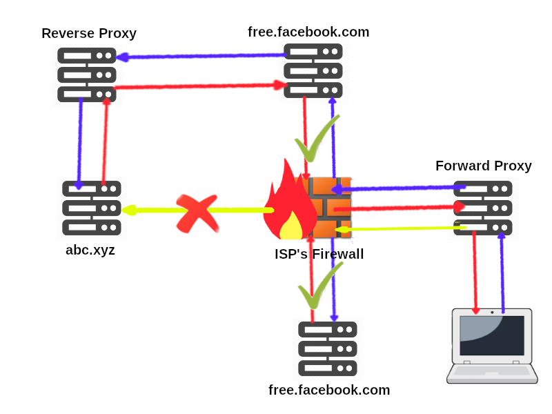

Topo Proxy
===

Introduction
--- 
Topo Proxy is a project who consist to offer free internet access in creating a tunnel through any website who is free to access.

*Here, it's a diagram showing how it's done.*


Installation
===

Depedencies
---

- In using pip
```sh
pip3 install requirements.txt
```

- In using pipenv
```sh
pipenv install
```

- Configuration of the variable environment
*Fill with your facebook credential.*
```sh
cp .env.example .env
```

The easiest way (Docker)
---
TODO

Usage
---
TODO


How it work!
===
TODO


Contribution
===
We are open for contribution. Feel you free to contribe.


License
===
[MIT](LICENSE)
